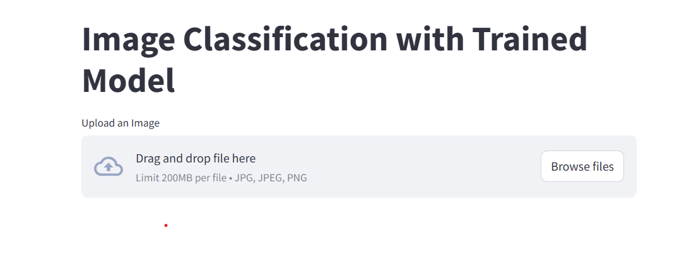

# fake_or_real
deep_fake



Steps to Run the App
Clone the Repository:

# **Image Classification App**

This repository contains a simple and interactive **image classification tool** built using **Streamlit** and a trained deep learning model. The app can classify images as `real` or `fake` with a confidence score.

---

## **Features**

- **Image Upload**: Users can upload an image in `jpg`, `jpeg`, or `png` format.
- **Real-time Classification**: The app predicts whether the image is `real` or `fake` using a pre-trained model.
- **User-Friendly Interface**: Built with Streamlit for an intuitive experience.

---

## **Getting Started**

Follow the steps below to set up and run the app on your local machine.

### **Prerequisites**
- Python 3.8 or higher
- Required Python packages listed in `requirements.txt`

---

### **Installation**

1. **Clone the Repository**:
   ```bash
   git clone https://github.com/yourusername/image-classification-app.git
   cd image-classification-app
   pip install -r requirements.txt
   streamlit run app.py
