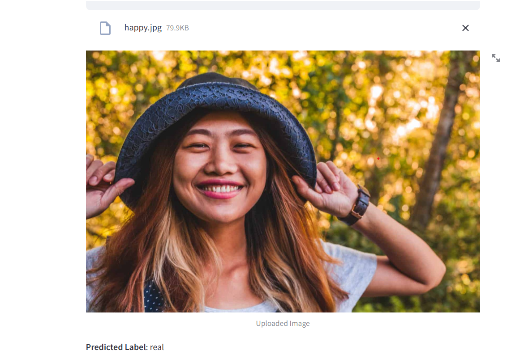

# fake_or_real
deep_fake

Steps to Run the App
Clone the Repository:

bash
Copier le code
git clone https://github.com/yourusername/image-classification-app.git
cd image-classification-app
Install Dependencies:

bash
Copier le code
pip install -r requirements.txt
Run the App:

bash
Copier le code
streamlit run app.py
Access the App: Open your browser and navigate to http://localhost:8501.